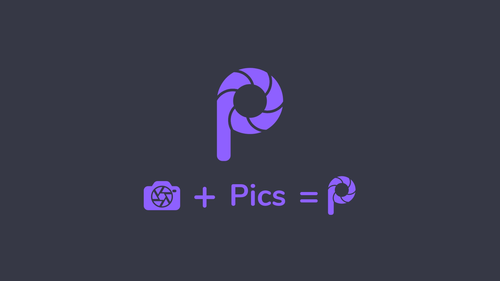
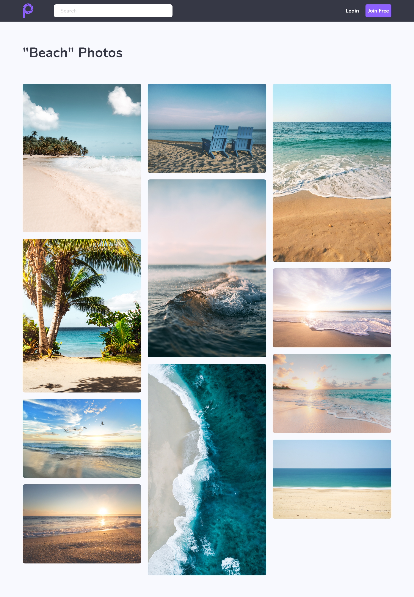
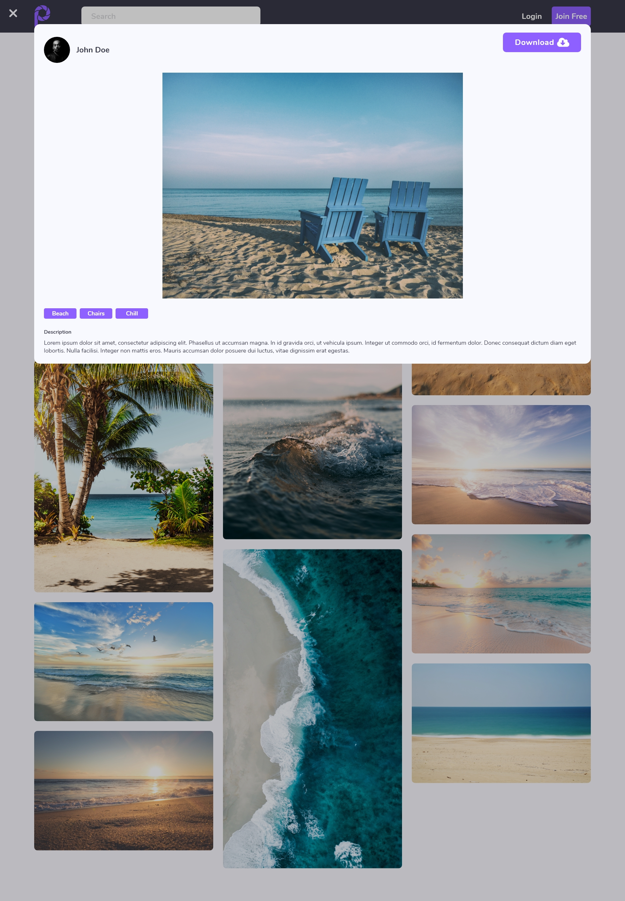
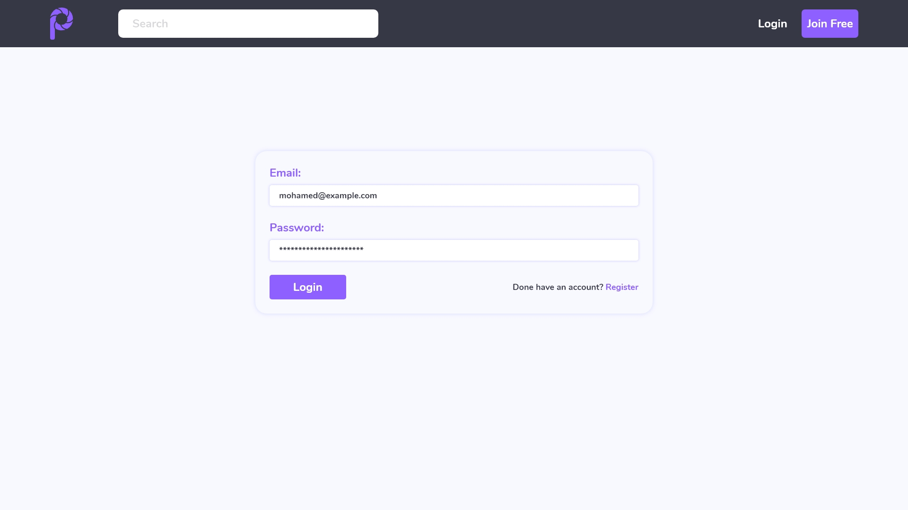

# **Pics 📸**
-------------------
**Unsplash clone made with Angular and Laravel with Algolia API ❤**

### **Setup**
---------------
1. Clone or download the project.

2. Create the database and configure `.env` file.

3. Run this command for storage configuration in larvel.
    ```bash
    php artisan storage:linke
    ``` 

4. Add [algolia](https://www.algolia.com/) app key and secret to the `.env` file.

5. Import `images` table data into Alogila app folowing this [guide](https://www.algolia.com/doc/framework-integration/laravel/indexing/import-into-algolia/?language=php).


**What I learned from it 😊**
* Using Angular with Laravel
* Using tymon/jwt-auth for authentication
* Using ngx-toastr for flash messages

### **Tools, Framworks And Libraries**
--------------------------------------
1. Design
    * Adobe XD
    * Illustrator (for the logo)
2. Backend
    * Laravel
    * Laravel Scout with Algolia
3. Frontend
    * Angular
    * ngx-toastr
    * Colcade
    * Gulp
    * Pug
    * Sass
    
## **Design** 
------------------------
_all text are lorem ipsum_

#### **Logo**


#### **Home**


#### **Search**


#### **Display Picture**


#### **Login**


See the design on 
[Behance](https://www.behance.net/gallery/93323065/Pics)

Video preview for the website [Vimeo](https://vimeo.com/395806882)

My
[Twitter](https://twitter.com/MrMohamed98) | 
[Linkedin](https://www.linkedin.com/in/mohamed-abdallah-b731b61a2/)